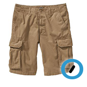
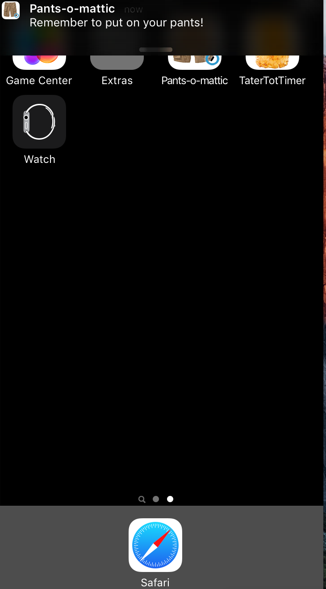
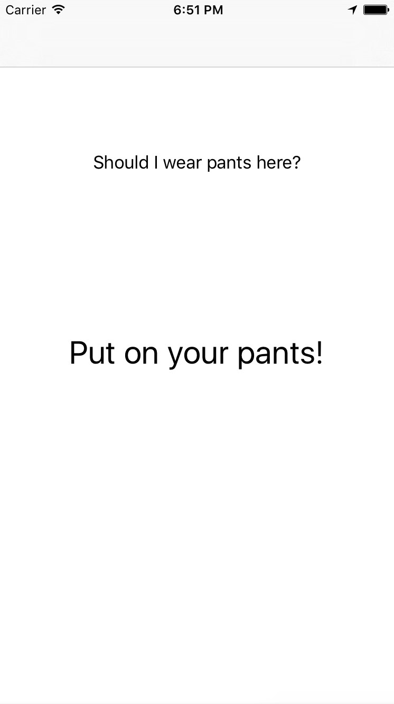

# Pants-o-mattic
Wondering if you should put on your pants? This app will help you!

### iOS Swift playground app made in order to learn iOS
Kudos @astralbodies for a great iOS development class!

# Some background
I have a privilige to work in a distributed company where many people work from home.
We often joke that many of us work without pants, especially that the book about our company is named

### [The year without pants](http://www.amazon.com/The-Year-Without-Pants-WordPress-com/dp/1118660633)

# What does this app do?

Application is location aware. When you leave your home, it will remind you to put on pants.
For now 'Home' is defined as downtown San Francisco, so it's usefull only for a limited number of people.
I'm working on settings screen.

